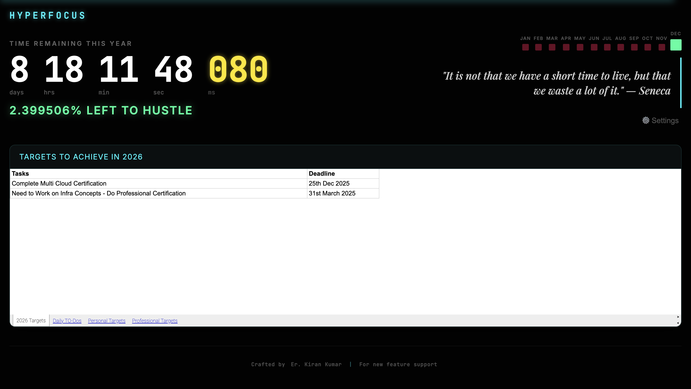

# ⚡ Hyperfocus

**Enter flow state. Track year-end countdown and manage tasks.**

Hyperfocus is a Chrome Extension designed to replace your new tab page with a high-impact, cyber-aesthetic dashboard. It creates urgency and focus by visualizing the time remaining in the year and embedding your personal task tracker directly into your browser.

## 📸 Demo & Screenshots

<!-- 
    INSTRUCTIONS: 
    1. Create a folder named 'media' in your repository root.
    2. Upload your 'screenshot.png' and 'demo.mp4' files there.
-->

> **🎥 Watch the Demo:**
> [Click here to watch the setup guide and demo video](media/demo.mp4)

## �🚀 Features

*   **Year Countdown:** Real-time countdown to the end of the year, down to the millisecond.
*   **Visual Progress:**
    *   **Year Progress Bar:** A visual line at the top showing percentage completion.
    *   **Month Grid:** Visual representation of past (Red), current (Neon Green), and future months.
*   **Task Management:** Embed your Google Sheet (Tasks/Goals) directly in the new tab.
*   **Cyber Aesthetic:** Dark mode, neon accents, and glitch typography to induce alertness.
*   **Motivation:** Impactful quotes to keep you inspired.

## 🛠️ Installation

Since this is a custom developer extension, you will install it manually in "Developer Mode". This works for Chrome, Edge, Brave, and other Chromium-based browsers.

1.  **Download the Code:**
    *   Clone this repository or download the ZIP file and extract it to a folder (e.g., `hyperfocus-extension`).

2.  **Open Extensions Management:**
    *   **Chrome:** Go to `chrome://extensions/`
    *   **Edge:** Go to `edge://extensions/`
    *   **Brave:** Go to `brave://extensions/`

3.  **Enable Developer Mode:**
    *   Look for a toggle switch named **"Developer mode"** (usually in the top right corner) and turn it **ON**.

4.  **Load the Extension:**
    *   Click the **"Load unpacked"** button (top left).
    *   Navigate to the repository folder (`hyperfocus-extension`).
    *   **IMPORTANT:** Select the specific **`extension`** folder inside (do NOT select the root folder).

5.  **Open a New Tab:**
    *   Open a new tab, and you should see the Hyperfocus dashboard!

## ⚙️ Configuration (Google Sheets)

To sync your tasks, you need to link a Google Sheet.

1.  Create or open a Google Sheet with your goals/tasks.
2.  **Recommended Method (Instant Sync):**
    *   Copy the URL from your browser address bar.
    *   It looks like: `https://docs.google.com/spreadsheets/d/YOUR_ID/edit#gid=0`
    *   Change the end from `/edit...` to `/preview`.
    *   Final URL: `https://docs.google.com/spreadsheets/d/YOUR_ID/preview`
3.  **In the Extension:**
    *   Click the **⚙️ Settings** button on the new tab page.
    *   Paste the URL.
    *   Click **Save**.

## 👨‍💻 Contact & Customization

Need a custom feature or want to connect?

*   **Developer:** Er. Kiran Kumar
*   **Email:** kk9840042@gmail.com
*   **LinkedIn:**  <a href="https://www.linkedin.com/in/kiran-kumar-sde/">Kiran Kumar</a>
>

---
*Built for those who hustle.* ⚡
